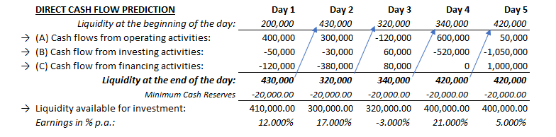
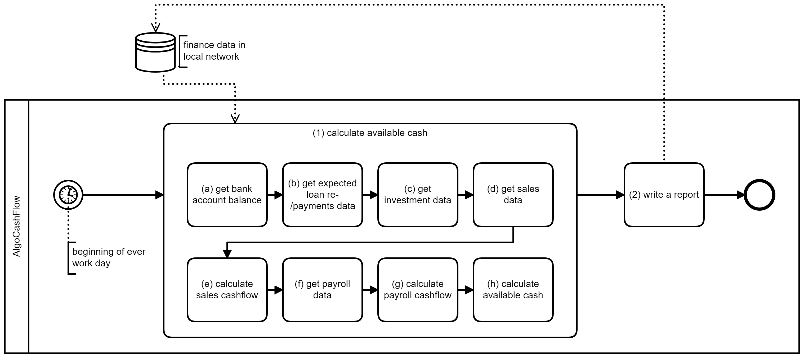
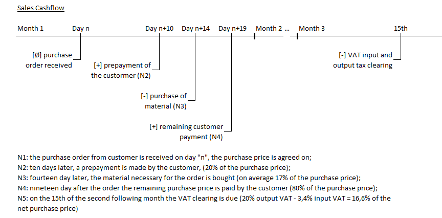
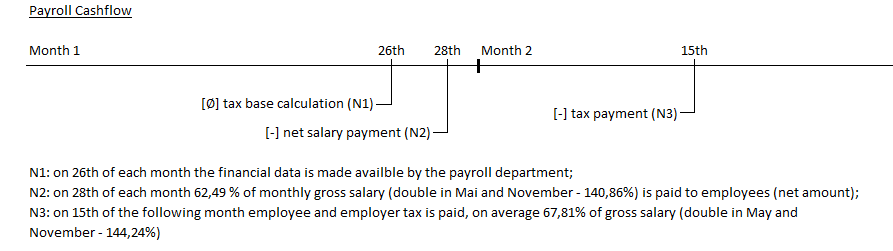

# Algo Cash Flow
Algorithmic cash flow prediction helps not only to identify liquidity shortage or resources free for investment in the future - it is also helpful to find defects in the contingency stragedy by running multiple hypothetic scenarios.

This project is a side product of my master degree studies of Software Design and Engineering at [University of Applied Sciences FH Campus Wien](https://www.fh-campuswien.ac.at/en/studies/study-courses/detail/software-design-and-engineering-master.html). It is a simple take on cash flow prediction using hypothetical business model and legal tax framework:  

## Prerequisites 
This is a .NET Core 2.1 console application using NuGet-Packages FileHelpers and Serilog 

## Execution
The cash flow is calculated based on the locally stored data from the financial system. In this simplified example sales, treasury, payroll and asset accounting are considered. The calculation process can be described as follows:

The sales cash flow it calculated based on the following payment schedule corresponding to a hypothetical business model and legal tax framework:

The payroll cash flow it calculated on the same principle:

## License
This project is released under the BSD license.